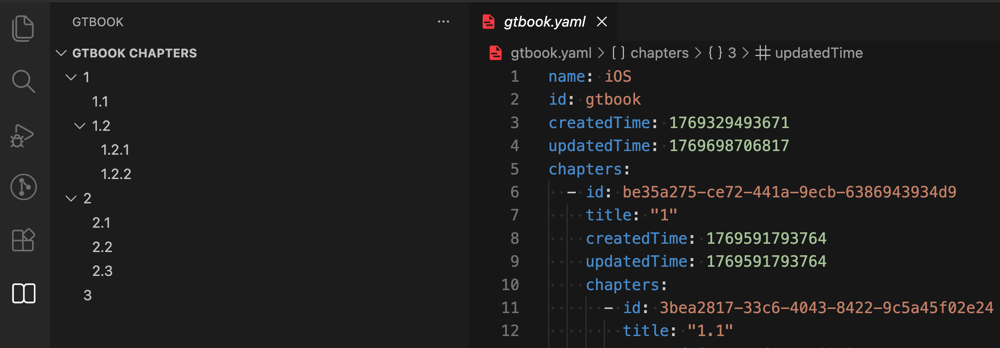

# gtbook-vscode

## Features

GTBook vscode extension helps you write a book by markdown and the book structure is defined in gtbook.yaml.

You can create, move, rename, delete chapters and sections.



``` yaml
name: iOS
id: gtbook
createdTime: 1769329493671
updatedTime: 1769698706817
chapters:
  - id: be35a275-ce72-441a-9ecb-6386943934d9
    title: "1"
    createdTime: 1769591793764
    updatedTime: 1769591793764
    chapters:
      - id: 3bea2817-33c6-4043-8422-9c5a45f02e24
        title: "1.1"
        createdTime: 1769595769025
        updatedTime: 1769595769025
        chapters: []
      - id: 871c23ba-fd97-4b00-b8e0-3103f0db97a4
        title: "1.2"
        createdTime: 1769595775064
        updatedTime: 1769595775064
        chapters:
          - id: d8b15bde-d0ac-40df-aea9-40ba9ebef6ca
            title: 1.2.1
            createdTime: 1769595780084
            updatedTime: 1769595780084
            chapters: []
          - id: e1380ead-da90-4c54-b417-e5b508ec3df0
            title: 1.2.2
            createdTime: 1769595777450
            updatedTime: 1769595777450
            chapters: []
  - id: 7bfb142d-32b2-4260-b3c6-012b75aedd96
    title: "2"
    createdTime: 1769595771820
    updatedTime: 1769595771820
    chapters:
      - id: 3733c3ff-b143-49d9-8e69-a3f5ea38a692
        title: "2.1"
        createdTime: 1769591798755
        updatedTime: 1769591798755
        chapters: []
      - id: 99e33c53-b3af-4312-99e6-7b3d66066c5f
        title: "2.2"
        createdTime: 1769653095703
        updatedTime: 1769653095703
        chapters: []
      - id: 3b8e8dd1-e1bb-4248-849d-e2d63f4ce54a
        title: "2.3"
        createdTime: 1769653087870
        updatedTime: 1769653087870
        chapters: []
  - id: 6613e1c6-dc59-4d72-8b24-94f84bb48bca
    title: "3"
    createdTime: 1769595782850
    updatedTime: 1769595782850
    chapters: []

```

## Release Notes

### 0.0.2

fix icons issue

### 0.0.1

GTBook vscode extension 0.0.1
